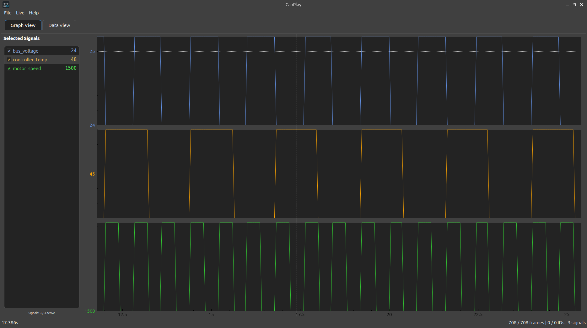

# CanPlay

中文 | [English](./README.en.md)

CanPlay 是一个基于 Qt 的跨平台桌面工具，用于 CAN 日志分析、DBC 解码、信号筛选与可视化回放。它面向车载网络调试、离线日志排查和信号观察场景，帮助用户从原始 CAN 帧快速定位到可读信号与变化趋势。



## 功能特性

- 导入 CAN 日志文件并在表格视图中查看原始帧
- 加载 DBC 文件并解析信号
- 图形视图与数据视图双视图切换
- 支持信号、CAN ID 的筛选与显示控制
- 针对选中信号进行曲线回放与趋势观察
- 适合作为离线分析工具，也可扩展到实时采集场景

## 使用场景

- 分析整车或 ECU 导出的 CAN 日志
- 借助 DBC 将原始帧还原为可读物理信号
- 在大量信号中快速筛选目标 CAN ID 或 Signal
- 通过图形视图回放信号变化过程，辅助定位异常波动
- 需要脚本或联调时，可使用 `mosquitto` 作为 MQTT Broker
- 需要做 DBC 脚本解析或校验时，可使用 Python 的 `cantools`

## 界面说明

CanPlay 当前提供两个核心工作视图：

- `Graph View`：用于选中信号的波形展示、趋势观察与回放
- `Data View`：用于查看原始日志帧、解析结果与筛选数据

左侧面板用于管理已选信号，主区域用于展示对应信号曲线，适合在单次分析过程中快速切换多个观测对象。

## MQTT 接口使用说明

CanPlay 支持在实时采集过程中通过 MQTT 暴露原始 CAN 收发能力，适合与脚本、测试平台或上位机联动。

使用前提：

- 先启动本机或网络可达的 MQTT Broker
- 在 CanPlay 中先启动实时采集
- 进入菜单 `Live -> MQTT Connect...`，填写 Broker 的 `IP` 和 `Port`
- MQTT Broker 可直接使用 `mosquitto`

连接成功后，CanPlay 会自动订阅命令主题，并开始按批次发布采集到的 CAN 帧。停止实时采集时，MQTT 连接会自动断开。

### Topic 一览

- `canplay/rx`：上行发布实时采集到的 CAN 帧批次
- `canplay/tx`：下行发送单帧发送请求
- `canplay/cfg`：下行更新批量发布参数
- `canplay/ack`：上行返回命令是否执行成功
- `canplay/st`：上行发布运行状态

### 接收实时 CAN 数据

`canplay/rx` 的消息体为 JSON 对象：

```json
{
  "b": 1713752130123000,
  "f": [
    [0, 291, 0, "11223344"],
    [2000, 292, 5, "5566778899AABBCC"]
  ]
}
```

字段说明：

- `b`：这一批数据的基准时间戳，单位微秒
- `f`：CAN 帧数组，每项格式为 `[delta_us, can_id, flags, data_hex]`
- `delta_us`：相对 `b` 的时间偏移，单位微秒
- `can_id`：十进制 CAN ID
- `flags`：标志位，`1` 表示扩展帧，`2` 表示 RTR，`4` 表示 CAN FD
- `data_hex`：不带分隔符的十六进制数据

### 发送单帧 CAN

向 `canplay/tx` 发布 JSON 数组：

```json
[291, 0, "11223344"]
```

数组格式：

```text
[can_id, flags, data_hex]
```

常用规则：

- 经典 CAN 帧长度不能超过 8 字节
- CAN FD 帧长度支持 `0-8, 12, 16, 20, 24, 32, 48, 64`
- 当 `flags` 含 `2` 时表示 RTR，请求里 `data_hex` 必须为空

执行成功时，CanPlay 会在 `canplay/ack` 发布：

```json
[1]
```

执行失败时，CanPlay 会在 `canplay/ack` 发布：

```json
[0, "error message"]
```

### 调整发布批次参数

向 `canplay/cfg` 发布 JSON 对象：

```json
{
  "i": 50,
  "n": 100,
  "s": 16384
}
```

字段说明：

- `i`：刷出周期，单位毫秒
- `n`：单批最多包含的帧数
- `s`：单批目标最大负载字节数

CanPlay 在满足任一条件时会发布一批 `canplay/rx` 数据：

- 到达刷出周期 `i`
- 缓冲帧数达到 `n`
- 估算负载大小达到 `s`

### 状态主题

`canplay/st` 的消息体为：

```json
{
  "c": 1,
  "m": 1,
  "df": 0
}
```

字段说明：

- `c`：实时采集是否运行，`1` 为运行中
- `m`：MQTT 是否已连接，`1` 为已连接，`0` 为已断开
- `df`：因 MQTT 侧缓冲区溢出而丢弃的接收帧数量

主动断开 MQTT 或停止实时采集时，CanPlay 会发布 `m = 0` 的状态消息，便于外部系统及时感知离线状态。

## Ubuntu 桌面安装

Linux 发布包目录 `CanPlay-<version>-linux-x86_64/` 内提供了 `install.sh`，用于安装 CanPlay 可执行文件、桌面启动器和图标。实际执行时可直接使用通配路径匹配当前版本目录。

脚本支持以下能力：

- 默认执行用户级安装
- 安装应用文件、命令入口和 `.desktop` 启动项到用户目录

使用示例：

```bash
chmod +x ./CanPlay-*-linux-x86_64/install.sh
./CanPlay-*-linux-x86_64/install.sh
```

使用 `--help` 查看帮助信息。

## 项目定位

CanPlay 专注于桌面端 CAN 数据可视化分析，强调以下几点：

- 基于 Qt，便于在 Linux、Windows 等平台上保持一致体验
- 面向工程调试流程，优先解决日志导入、信号解码、筛选和回放
- 以轻量直接的交互方式降低离线 CAN 数据分析成本
